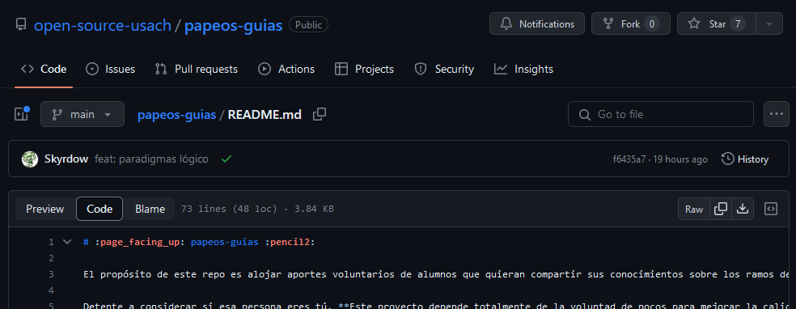

# Markdown

- [Markdown](#markdown)
- [Como ver el código](#como-ver-el-código)
- [Sintaxis de markdown](#sintaxis-de-markdown)
- [Este es un cabezal 1](#este-es-un-cabezal-1)
- [Este es un cabezal 2](#este-es-un-cabezal-2)
  - [Este es un cabezal 3](#este-es-un-cabezal-3)
- [Previsualizadores de Markdown](#previsualizadores-de-markdown)
  - [Editor de markdown online](#editor-de-markdown-online)
  - [Extensión de VSCode](#extensión-de-vscode)
  - [Extensión de navegador](#extensión-de-navegador)
- [Fuentes](#fuentes)


# Como ver el código
Para ver el código detrás de un markdown, puedes hacer click en el botón `Code` al abrir el archivo *(los `README.md` se abren automaticamente pero no tienen el botón en la vista de la carpeta)*.


# Sintaxis de markdown

Este es un texto normal

Para forzar un salto de linea <br> puedes agregar `<br>`

# Este es un cabezal 1
# Este es un cabezal 2
## Este es un cabezal 3

Puedes agregar *italics*, **negrita**, ***ambas***, :smile:, 

> Una cita textual
>
> multilinea

1. Esto es
2. una lista
3. ordenada
   
- Esto es
- una lista
- desordenada

`Este es código de una línea`

```
Este es un bloque de código sin lenguaje
```

```c
char *mensaje = "Este es un bloque de código de c";
```

[Este es un link](https://github.com/open-source-usach/)

[Este es un link a un archivo del repo](./README.md)

[Este es un link a un cabezal de este .md](#como-ver-el-código)

[Este es un link a un archivo en una sub-carpeta](./sources/USACHIN/IA/IA_14.png)

Esta es una imagen a tamaño original, este método es más rápido pero tienes menos control (una tabla puede restringir el tamaño automáticamente):


Esta es una imagen si quieres hacer modificaciones:


Una imagen de altura 16 es del mismo tamaño que el texto, pero es más dificil de ver
.
Github usa un html más limitado que el normal

Esto es una tabla:
| Syntax | Description |
| ----------- | ----------- |
| Header | Title |
| Paragraph | Text |

Esto es un párrafo con una nota
[^1]

[^1]: Esta es la nota, en el código no está al final del documento.

- [ ] Esta es una tarea por hacer
- [x] Esta es una tarea hecha

# Previsualizadores de Markdown
Si quieres ver la previsualización de tu markdown, tienes varias opciones:

## Editor de markdown online
[Markdown Editor](https://jbt.github.io/markdown-editor/)

La desventaja más grande es que no podrás incluir imágenes locales o enlaces a archivos dentro del repo.

## Extensión de VSCode
[Markdown Preview Github Styling](https://marketplace.visualstudio.com/items?itemName=bierner.markdown-preview-github-styles)

Funciona y es fácil de instalar, pero algunas veces la visualización es diferente a la de github.

## Extensión de navegador
[Markdown Viewer](https://github.com/simov/markdown-viewer)

Funciona arrastrando el archivo al navegador y recargando la página, la visualización es la más cercana a la de github.
Opciones recomendadas: `theme: github-dark` y `autoreload`.

# Fuentes

- https://www.markdownguide.org/cheat-sheet/ - Esta página es más fácil de leer, pero no es la versión de markdown que usa Github, así que no todo funciona
- https://github.github.com/gfm/ - Github Flavored Markdown

